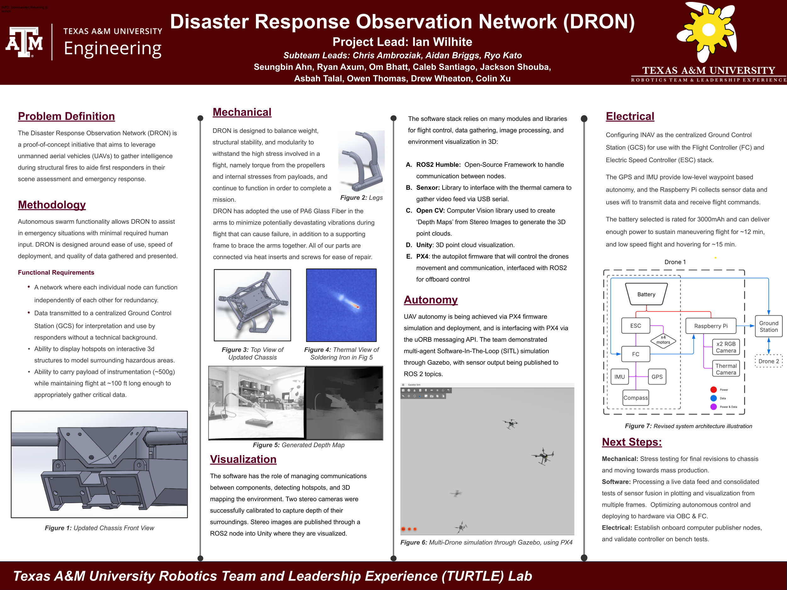

# DRON: Disaster Response Observation Network

The DRON Project is a tool designed to aid first responders in their response to structural fires by collecting and providing key data on the hotspots within the structure. The goal of the project is to create a swarm of drones equipped with lidar and infrared cameras, capable of autonomously navigating a complex environment and reporting on the active development of the fire.

## Table of Contents

- [Project Overview](#project-overview)
- [Flight Videos](#flight-test-videos)
- [Poster](#project-poster)
- [Team Members](#team-members)
- [Getting Started](#getting-started)
- [Contributing](#contributing)
- [License](#license)

## Project Overview

The Disaster Response Observation Network, more commonly known as DRON, is the student led project with the goal of aiding firefighters and first responders during large structural fires by providing detailed information about the location, intensity and growth of fires, which is crucial to the proper response. By improving the ability of first responders to actively respond to events, we intend to save lives.

The primary objectives of this project are as follows:
- Implement a drone with all sensors for autonomous flight and data acquisition.
- Collaborate between drones for decision making and obstacle detection.
- Communicate live data to the first responders in an easy to understand format.

## Flight Test Videos

https://github.com/user-attachments/assets/b51cd1a6-a516-4e84-9459-9f7f23fdade3

https://github.com/user-attachments/assets/e583ee48-7b87-49e9-ae21-030e9a4f5374

## Project Poster




## Team Members

### Project Leadership
- **[Ian Wilhite](https://www.linkedin.com/in/ian-wilhite)**
  - Major: Robotics and Controls Engineering
  - Role: Project Lead
  - Year: Senior

- **[Aidan Briggs](https://www.linkedin.com/in/aidan-briggs-108297250/)**
  - Major: Computer Science
  - Role: Visualization Subteam Lead
  - Year: Senior

- **[Chris Ambroziak](https://www.linkedin.com/in/chris-ambroziak/)**
  - Major: Computer Engineering
  - Role: Autonomy Subteam Lead
  - Year: Junior

- **[Jacob Fuerst](https://www.linkedin.com/in/jacob-fuerst)**
  - Major: Mechanical Engineering
  - Role: Electrical Subteam Lead
  - Year: Junior

- **[Ryo Kato](https://www.linkedin.com/in/ryokato-texasam/)**
  - Major: Mechanical Engineering
  - Role: Mechanical Subteam Lead
  - Year: Sophomore

### Mechanical Subteam

- **[Caleb Santiago](https://www.linkedin.com/in/calebmsantiago/)**
  - Major: Computer Engineering
  - Year: Senior

- **[Drew Wheaton](https://www.linkedin.com/in/drew-wheaton-551a89362/)**
  - Major: Mechanical Engineering
  - Year: Junior
    
- **[Asbah Talal](https://www.linkedin.com/in/asbah-talal/)**
  - Major: General Engineering
  - Year: Freshman

- **[Jackson Shouba](https://www.linkedin.com/in/jackson-shouba/)**
  - Major: General Engineering
  - Year: Freshman

- **[Luke Breedlove](https://www.linkedin.com/in/luke-breedlove-8a5007325)**
  - Major: Mechanical Engineering
  - Year: Sophomore

- **[Charlie Weatherspoon](https://www.linkedin.com/in/cweatherspoon397)**
  - Major: Mechanical Engineering
  - Year: Sophomore

### Software Subteam

- **[Treasa Francis](https://www.linkedin.com/in/treasafrancis/)**
  - Major: Computer Engineering
  - Year: Junior
 
- **[Jason Lev](https://www.linkedin.com/in/Jason-Lev-312492240/)**
  - Major: Computer Science
  - Year: Junior

- **[Colin Xu](https://www.linkedin.com/in/colinsxu/)**
  - Major: Computer Science
  - Year: Junior

- **[Owen Thomas](https://www.linkedin.com/in/owen-thomas-44aa4230a/)**
  - Major: Computer Science
  - Year: Junior

- **[Om Bhatt](https://www.linkedin.com/in/ombhattofficial)**
  - Major: Mechatronics Engineering
  - Year: Sophomore

- **[Riya Shah](https://www.linkedin.com/in/riya-shah-448318368)**
  - Major: Electrical Engineering
  - Year: Sophomore
  
- **[Matthew Shi](https://www.linkedin.com/in/matthewtershi)**
  - Major: Computer Engineering
  - Year: Sophomore

- **[Visith So](https://www.linkedin.com/in/visith-so-b28ab9186)**
  - Major: Computer Engineering
  - Year: Junior

    

### Electrical Subteam

- **[Chris Ambroziak](https://www.linkedin.com/in/)**
  - Major: Computer Engineering
  - Year: Junior

- **[Seungbin (Jay) Ahn](https://www.linkedin.com/in/seungbina/)**
  - Major: Electrical Engineering
  - Year: Sophomore

### Alumni

- **[Abel Ayala](https://www.linkedin.com/in/ug-abel-ayala-co2024/)**
  - Major: Multidisciplinary Engineering Technology
  - Role: Project Lead, Software & Mechanical

- **[Elizabeth Hannsz](https://www.linkedin.com/in/elizabeth-hannsz-2932a51ba/)**
  - Major: Aerospace Engineering
  - Role: Mechanical Subteam Lead

- **[Brian Russell](www.linkedin.com/in/brian-russell-275a361a3)**
  - Major: Aerospace Engineering
  - Role: Software Team

- **[Quinn Belmar](https://www.linkedin.com/in/quinnbelmar/)**
  - Major: Mechanical Engineering 
  - Role: Electrical Team

- **[Jacob Adamson](https://www.linkedin.com/in/jacob-adamson/)**
  - Major: Electrical Engineering
  - Role: Electrical Team
  
- **[Lucas Ybarra](https://www.linkedin.com/in/lucas-ybarra-847ba72b6/)**
  - Major: Electrical Engineering
  - Role: Electrical Team
  
- **[Aneek Roy](https://www.linkedin.com/in/aneekroy/)**
  - Major: Electrical Engineering 
  - Role: Electrical Team

- **[Malcolm Ferguson](https://www.linkedin.com/in/malcolmkferguson)**
  - Major: Mechatronics Engineering
  - Role: Mechanical Team

- **[Christus Creer](https://www.linkedin.com/in/fpchristuscreer)**
  - Major: Industrial Systems Engineering
  - Role: Mechanical Team

- **[Alan Alvarado](https://www.linkedin.com/in/alan-alvarado-1797102ab)**
  - Major: Mechanical Engineering
  - Role: Mechanical Team
 
- **[Felix Chim](https://www.linkedin.com/in/felix-chim-3066a6228)**
  - Major: Aerospace Engineering 
  - Role: Mechanical Team
    
- **[Nahum Tadesse](https://www.linkedin.com/in/nahum-tadesse-51ba922b6/)**
  - Major: Mechanical Engineering
  - Role: Mechanical Team

- **[Aaron Velez](https://www.linkedin.com/in/aaron-velez-1083bb2b4)**
  - Major: Manufacturing and Mechanical Technology
  - Role: Mechanical Team

- **[Elizabeth Person](https://www.linkedin.com/in/elizabeth-person-041a51252/)**
  - Major: Aerospace Engineering
  - Role: Mechanical Team

- **[Nicholas Summa](https://www.linkedin.com/in/nicholas-summa-3905342b8/)**
  - Major: Computer Engineering
  - Role: Software Team
  - Year: Sophomore

- **[Alonso Peralta](https://www.linkedin.com/in/alonso-peralta-espinoza-715419212/)**
  - Major: Computer Engineering
  - Role: Software Team

## Getting Started

To get started with DRON, follow these steps:

1. **Clone the Repository**:
   ```
   git clone https://github.com/turtle-robotics/DRON.git
   ```

2. **Install Dependencies**: Depending on the software and hardware components used, install the required dependencies and libraries as outlined in the project documentation.

3. **Build the Drone**: Follow the instructions provided to construct the physical drone including all sensors. 

4. **Calibration and Testing**: Perform the necessary calibration and begin testing the drone (ideally in a controlled environment). *Please verify all [local FAA rules](https://www.faa.gov/uas/resources/community_engagement/no_drone_zone) and obtain [any necessary licenses](https://www.faa.gov/uas/commercial_operators/become_a_drone_pilot) before beginning operations.*

5. **Contribute**: If you have ideas or improvements to contribute, please refer to the [Contributing](#contributing) section below.

## Contributing

We welcome contributions from the open-source community and anyone interested in enhancing this project. See [CONTRIBUTING.md](CONTRIBUTING.md) for setup instructions, branch naming, commit and pull request conventions, and testing expectations.

## License

This project is licensed under the [MIT License](LICENSE.md), which means that you are free to use, modify, and distribute the code as long as you provide proper attribution and include the original license in your distribution. Please review the full license for more details.
